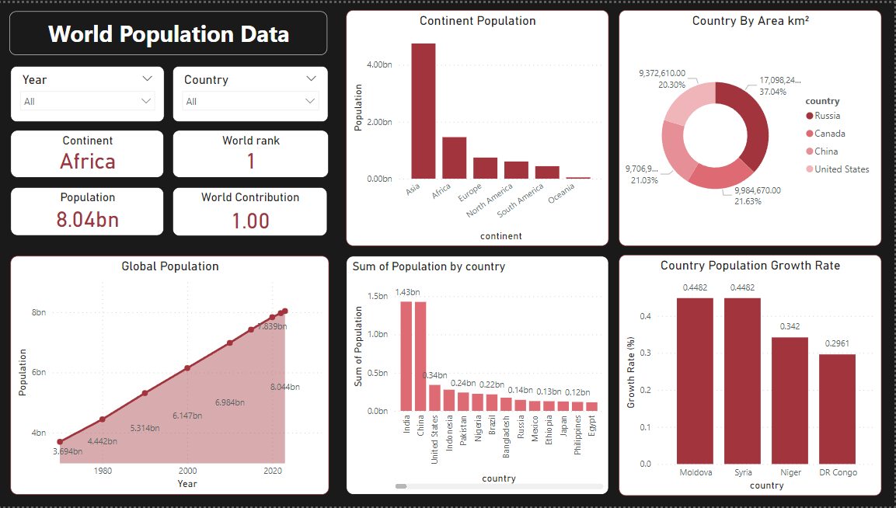

# World Population Visualization
Welcome to the World Population Visualization repository! This project employs Microsoft Power BI to showcase insightful visualizations of global population trends.

## Features

- **Interactive Dashboards:** Explore user-friendly dashboards for a comprehensive view of population dynamics.
- **Regional Breakdowns:** Dive into detailed breakdowns by continents, countries, and regions.

## Power BI Visualization

### Final Dashboard
[](Images/FinalVisualization.png)


## Getting Started

1. **Clone the Repository:**
   ```bash
   git clone https://github.com/Tomioka-Giyuu/WorldPopulation-DataVisualization.git
